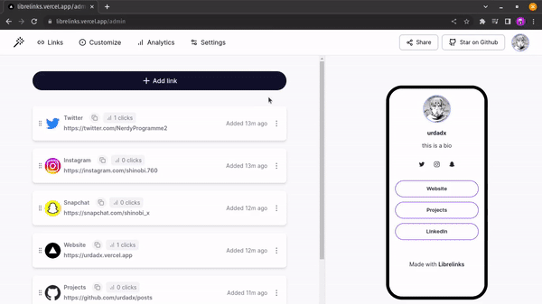

# Librelinks

Librelinks is an open-source link in bio tool for everyone.

The goal of Librelinks is to provide users with a platform that helps them to connect to their audience through a single link.

Official site: [https://librelinks.me](https://librelinks.me)

An example Librelinks page: [https://librelinks.me/maayez](https://librelinks.me/maayez)

## ⚒️ Demo

Create and customize your link in bio in minutes✨

## ⭐ Features

It has 4 Core Features:
| 
**Feature**
 | **Description** |
|---|---|
| **1. Customize your page** | You can easily customize your page with beautiful themes and color palettes |
| **2. Keep track of everything** | Get useful insights on your profile like the number of views, clicks, countries, devices etc.|
| **3. Shareable links** | Share your profile everywhere with just one unique link tailor made for you |
**4. Privacy centered** | All your links belong to you, we do not sell your data.

## 📚 Tech Stack

| 
**Category**
 | 
**Choice**
                                         | **Descriptions**                                                                                                                                                                 |
| ------------------------------------------- | --------------------------------------------------------------------------------- | -------------------------------------------------------------------------------------------------------------------------------------------------------------------------------- |
| **Language**                                | [JavaScript](https://github.com/microsoft/TypeScript)                             | JavaScript (JS) is a cross-platform, object-oriented programming language used by developers to make web pages interactive.                                                      |
| **UI Library**                              | [React](https://github.com/facebook/react)                                        | React’s declarative syntax and component-based architecture make it simple to develop reactive reusable components.                                                              |
| **CSS Framework**                           | [Tailwind CSS](https://github.com/tailwindlabs/tailwindcss)                       | Tailwind speeds up development by providing helpful css utilities and removing the need to context switch between jsx and css files.                                             |
| **Web Framework**                           | [NextJS 13](https://github.com/vercel/next.js)                                    | Next.js supports static site generation and helps build efficient React webpages that support SEO.                                                                               |
| **Database**                                | [MongoDB & Prisma](https://www.mongodb.com/docs/manual/reference/program/mongod/) | MongoDB is a source-available cross-platform document-oriented database program. Classified as a NoSQL database program, MongoDB uses JSON-like documents with optional schemas. |
| **Analytics**                               | [Tinybird](https://www.tinybird.co/)                                              | A realtime analytics platform for data and engineering teams.                                                                                                                    |

## 📁 Project Structure

Librelinks is created with the NextJS web framework and follows its project structure.

| 
**Page Route**
 | **Code Path**               | **Description**                                 |
| --------------------------------------------- | --------------------------- | ----------------------------------------------- |
| /                                             | /index.jsx                  | Home page/ landing page                         |
| /components                                   | /components                 | Contains all the components used in the project |
| /admin                                        | /admin/index.jsx/           | The user's playground                           |
| /login and /register                          | /login.jsx or /register.jsx | The pages for authenticating the user           |
| admin/[page]                                  | admin/[page]/index.jsx/     | Individual page for customizing your profile    |

## Environment variables 🔑

You need to have the following env variables in your `.env` file to make the application work properly

`DATABASE_URL` = XXXXXXX

`GOOGLE_CLIENT_ID` = XXXXXX

`GOOGLE_CLIENT_SECRET` = XXXXXXXX

`NODE_ENV` = development

`NEXTAUTH_JWT_SECRET` = XXXXX

`NEXTAUTH_SECRET` = XXXXX

Checkout the `.env.example` file to learn how to get started.

## 💻 Local Development

1. Download the repo `git clone https://github.com/urdadx/librelinks.git`
2. Change the directory `cd librelinks`
3. Install the dependency `npm install`
4. Start a development server `npm run dev`
5. Open your browser and visit [http://localhost:3000](http://localhost:3000) to see Librelinks live

## Contributing 🤝

We love our contributors! Here's how you can contribute:

- [Open an issue](https://github.com/urdadx/librelinks/issues) if you believe you've encountered a bug.
- Make a [pull request](https://github.com/urdadx/librelinks/pull) to add new features/make quality-of-life improvements/fix bugs.

## Repo Activity

## Liscence 📝

MIT

## Give this repo a star ⭐.
